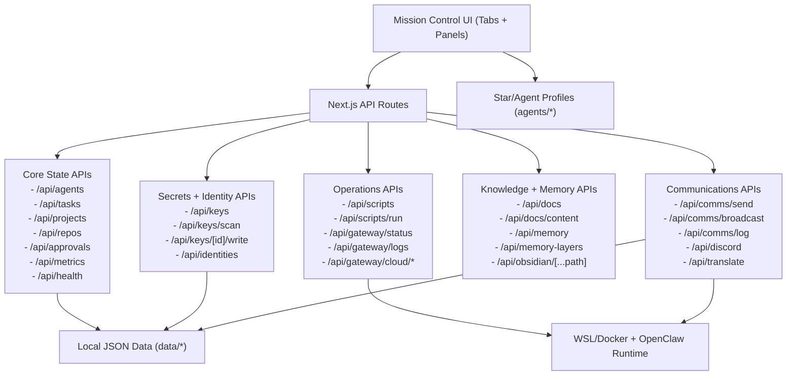

# Mission Control

Mission Control is a Next.js control plane for Constellation operations: stars/agent management, communications, approvals, memory, keys, docs, scripts, and translation.

## For Developers

- UI: `app/components/*` (tab views and system panels)
- APIs: `app/api/*` (state + integrations)
- Runtime data: `data/*`
- Agent profiles: `agents/*`
- Operations docs: `docs/*`
- Utility scripts: `scripts/*`

## Feature Diagram



Full diagram doc: [`docs/FEATURES_DIAGRAM.md`](docs/FEATURES_DIAGRAM.md)

## Getting Started

```bash
npm install
npm run dev
```

Open `http://localhost:3030`.
