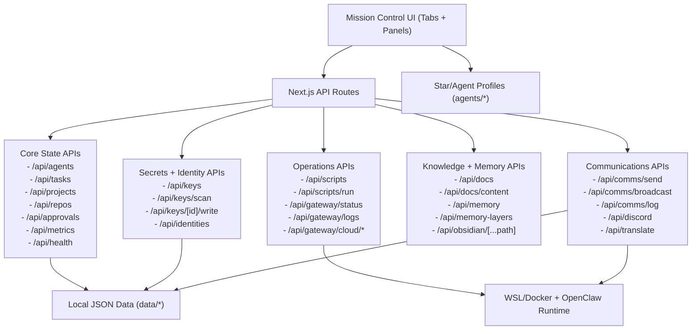

# Mission Control

Mission Control is an operations cockpit for running a multi-agent constellation from one place.
It is built for operators, founders, and technical teams coordinating stars/agents across comms, memory, keys, approvals, and runtime controls.
It solves the fragmentation problem: instead of jumping between tools and terminals, you get one control plane for visibility, routing, and recovery.

## Quick Start (2 Minutes)

```bash
npm install
npm run dev
```

Open `http://localhost:3030`.

## Demo

Add a screenshot or GIF here so visitors instantly see the product:

- Suggested path: `docs/assets/mission-control-demo.gif`
- Suggested size: 1400x900 (or similar 16:9)
- Keep duration short: 8 to 20 seconds

Example embed line to use after you add the file:

```md

```

## For Developers

- UI: `app/components/*` (tab views and system panels)
- APIs: `app/api/*` (state + integrations)
- Runtime data: `data/*`
- Agent profiles: `agents/*`
- Operations docs: `docs/*`
- Utility scripts: `scripts/*`

## Feature Diagram



Full diagram docs:
- [`docs/FEATURES_DIAGRAM.md`](docs/FEATURES_DIAGRAM.md)
- [`docs/STAR_PROVIDER_FLOW.md`](docs/STAR_PROVIDER_FLOW.md)
