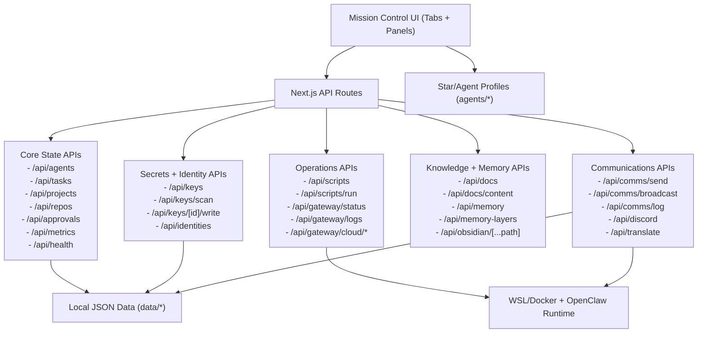

# Mission Control

Mission Control is a control plane for multi-agent operations.
It is for operators and technical teams coordinating stars/agents across comms, memory, keys, approvals, and runtime controls.
It replaces fragmented tool-switching with one place to see status, route work, and recover fast.

## Quick Start (2 Minutes)

```bash
npm install
npm run dev
```

Open `http://localhost:3030`.

## Demo

Add one screenshot or short GIF so visitors can feel the product quickly.

- Path: `docs/assets/mission-control-demo.gif`
- Size: ~1400x900 (16:9)
- Length: 8 to 20 seconds

Embed:

```md

```

Social preview spec: [`docs/assets/social-preview-spec.md`](docs/assets/social-preview-spec.md)

## For Developers

- UI: `app/components/*` (tab views and system panels)
- APIs: `app/api/*` (state + integrations)
- Runtime data: `data/*`
- Agent profiles: `agents/*`
- Operations docs: `docs/*`
- Utility scripts: `scripts/*`

## Feature Diagram



Full diagram docs:
- [`docs/FEATURES_DIAGRAM.md`](docs/FEATURES_DIAGRAM.md)
- [`docs/STAR_PROVIDER_FLOW.md`](docs/STAR_PROVIDER_FLOW.md)
