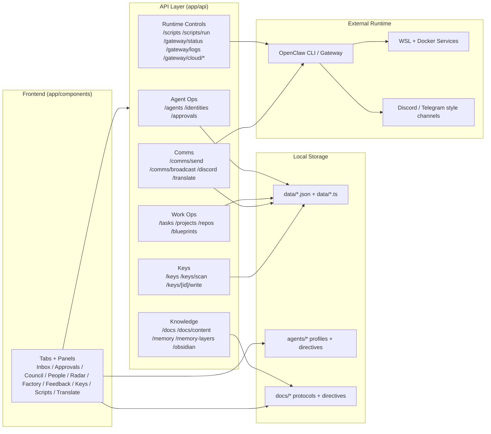

# Features Diagram

This diagram is the quick map for developers onboarding to Mission Control.

```mermaid
flowchart LR
  subgraph Frontend["Frontend (app/components)"]
    Tabs["Tabs + Panels
    Inbox / Approvals / Council / People / Radar / Factory / Feedback / Keys / Scripts / Translate"]
  end

  subgraph API["API Layer (app/api)"]
    AgentOps["Agent Ops
    /agents /identities /approvals"]
    WorkOps["Work Ops
    /tasks /projects /repos /blueprints"]
    CommsOps["Comms
    /comms/send /comms/broadcast /discord /translate"]
    KnowledgeOps["Knowledge
    /docs /docs/content /memory /memory-layers /obsidian"]
    RuntimeOps["Runtime Controls
    /scripts /scripts/run /gateway/status /gateway/logs /gateway/cloud/*"]
    KeyOps["Keys
    /keys /keys/scan /keys/[id]/write"]
  end

  subgraph Storage["Local Storage"]
    JsonData["data/*.json + data/*.ts"]
    AgentFiles["agents/* profiles + directives"]
    DocFiles["docs/* protocols + directives"]
  end

  subgraph Runtime["External Runtime"]
    OpenClaw["OpenClaw CLI / Gateway"]
    WSLDocker["WSL + Docker Services"]
    Discord["Discord / Telegram style channels"]
  end

  Tabs --> API
  AgentOps --> JsonData
  WorkOps --> JsonData
  CommsOps --> JsonData
  KnowledgeOps --> DocFiles
  KeyOps --> JsonData

  RuntimeOps --> OpenClaw
  CommsOps --> OpenClaw
  OpenClaw --> WSLDocker
  OpenClaw --> Discord

  Tabs --> AgentFiles
  Tabs --> DocFiles
```
