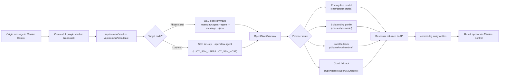

# Star-to-Provider Flow

Use this to debug delivery, timeout, and provider-fallback issues.

## Quick Troubleshooting Order

1. Check node reachability (Phoenix local vs Lucy SSH).
2. Check gateway health (`/api/gateway/status` and `/api/gateway/logs`).
3. Check star model profile (fast vs build profile).
4. Check provider credentials in Key Keeper / env.
5. Re-run via single send before broadcast.
